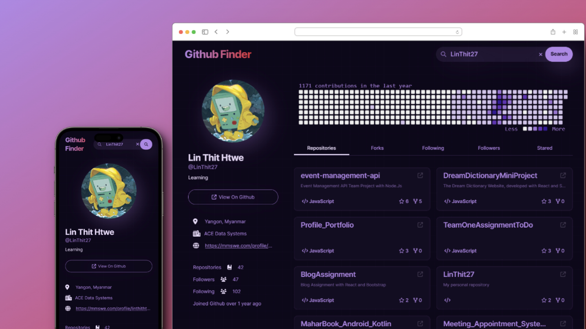
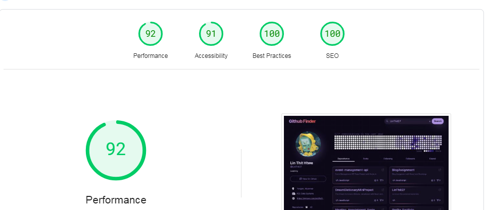

# Github Finder





Welcome to the GitHub User Search website, a NextJs and TailwindCss project designed for seamless GitHub user account exploration.

## Overview

This project use with the [Github REST API](https://docs.github.com/en/rest)  for searching GitHub data and [deno-github-contributions-api](https://github.com/kawarimidoll/deno-github-contributions-api) for  the contribution graph .

## Page Performance Test

Results from [pagespeed.web.dev](https://pagespeed.web.dev/):




## Contributions

Feedback and Contributions are welcome 

## Star the Project

If you find this project useful or enjoyable, consider leaving a star. Your support motivates me to continue improving and enhancing the features.

## Inspiration

The project [https://blazor-wasm-git-finder.netlify.app/](https://blazor-wasm-git-finder.netlify.app/) by [@sannlynnhtun-coding](https://github.com/sannlynnhtun-coding) served as a source of inspiration for creating my own rendition of the project.

<details>
<summary>Project Setup</summary>


This is a [Next.js](https://nextjs.org/) project bootstrapped with [`create-next-app`](https://github.com/vercel/next.js/tree/canary/packages/create-next-app).

## Getting Started

First, install necessary dependencies
```bash 
npm i 
#or
npm install
```

After that, run the development server:

```bash
npm run dev
# or
yarn dev
# or
pnpm dev
# or
bun dev
```

Open [http://localhost:3000](http://localhost:3000) with your browser to see the result.

You can start editing the page by modifying `app/page.tsx`. The page auto-updates as you edit the file.

This project uses [`next/font`](https://nextjs.org/docs/basic-features/font-optimization) to automatically optimize and load Inter, a custom Google Font.

## Learn More

To learn more about Next.js, take a look at the following resources:

- [Next.js Documentation](https://nextjs.org/docs) - learn about Next.js features and API.
- [Learn Next.js](https://nextjs.org/learn) - an interactive Next.js tutorial.

You can check out [the Next.js GitHub repository](https://github.com/vercel/next.js/) - your feedback and contributions are welcome!


## Deploy on Vercel

The easiest way to deploy your Next.js app is to use the [Vercel Platform](https://vercel.com/new?utm_medium=default-template&filter=next.js&utm_source=create-next-app&utm_campaign=create-next-app-readme) from the creators of Next.js.

Check out our [Next.js deployment documentation](https://nextjs.org/docs/deployment) for more details.


</details>
